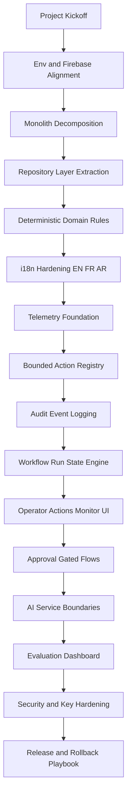

# Project Status Board

Last updated: 2026-05-27

## Current Position

- Current phase: Phase 8 - Launch
- Current step: Step 18 of 18
- Status: Completed
- Focus now: Completed baseline architecture roadmap

## Phase Legend

1. Stabilize
2. Structure
3. Bound
4. Observe
5. Govern
6. Evaluate
7. Harden
8. Launch

## Delivery Chart

## Step Tracker

- [x] 1. Env and Firebase alignment
- [x] 2. Monolith decomposition
- [x] 3. Repository extraction
- [x] 4. Domain validators and deterministic scoring
- [x] 5. i18n hardening (EN/FR/AR)
- [x] 6. Telemetry repositories (ledger + agent proofs)
- [x] 7. Match output placeholders (tracking and confidence)
- [x] 8. Bounded action registry introduced
- [x] 9. Audit event repository introduced
- [x] 10. AppShell matching wired through action registry
- [x] 11. Workflow run repository and state transitions
- [x] 12. Admin actions monitor screen
- [x] 13. Approval queue and human gates
- [x] 14. AI service adapters with schema-safe parsing
- [x] 15. Outcome and interaction lifecycle persistence
- [x] 16. Evaluation dashboard KPIs
- [x] 17. Security hardening pass
- [x] 18. Release and rollback playbook

## Working Agreement

- This file is the canonical progress board.
- Every major implementation step updates this board.
- If priorities change, the "Current Position" and checklist are updated first.
